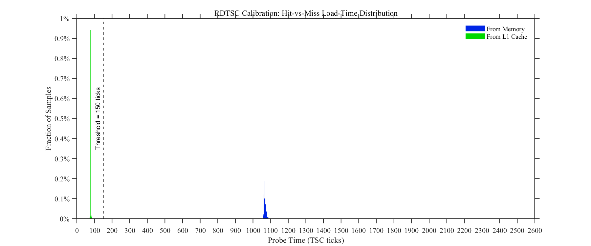
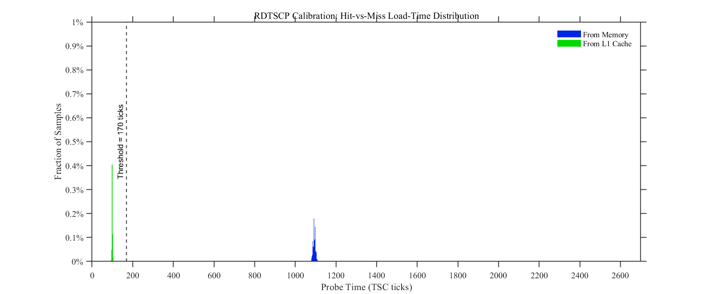

# Week 1 Flush+Reload Calibration Report

## Deliverable summary

This calibration establishes a timing threshold that separates a cache **hit** from a cache **miss** for the Week 1 Flush+Reload probe.

| Probe variant | Hit median | Miss median | Selected threshold | Classification rule | Observed error |
|---|:---|:---|:---|:--|:---|
| **RDTSC control** | 78 ticks | 1068 ticks | **150 ticks** | `< 150` = hit; `>= 150` = miss | 1 false miss, 0 false hits; 0.001% overall |
| **RDTSCP formal** | 100 ticks | 1094 ticks | **170 ticks** | `< 170` = hit; `>= 170` = miss | 0 false misses, 0 false hits; 0% overall |

The **formal Week 1 threshold is 170 TSC ticks with RDTSCP + LFENCE**. The RDTSC result is retained as a control experiment to quantify timestamp-instruction overhead.

## Probe and measurement procedure

The probe uses a 64-byte cache line in a shared, read-only, file-backed `MAP_SHARED` mapping. Each sample is prepared independently:

```text
flush target with clflush
-> mfence
-> flush-settle busy-wait (5000 NOPs)
-> HIT condition: one untimed load
   MISS condition: no access to the target
-> reload-settle busy-wait (5000 NOPs)
-> timed reload
-> store the result in memory
```

The timed reload is fenced so that the timestamp interval encloses the target load. The formal timer is:

```asm
lfence
rdtscp
lfence
load target
lfence
rdtscp
lfence
subtract timestamps
```

The RDTSC control uses the equivalent LFENCE-delimited sequence with `RDTSC` in place of `RDTSCP`. In both cases, samples are buffered and written after measurement rather than printing or performing file I/O inside the timing loop.

## Calibration histograms

### RDTSC control experiment



The green hit distribution is concentrated near 98–100 ticks; 92.32% of hit samples lie between 98 and 102 ticks. The blue miss distribution is centered near 1092–1094 ticks, with a minimum of 824 ticks. The selected threshold of **170 ticks** lies in the wide empty gap between the two distributions: it is above the largest observed hit (156 ticks) and below the smallest observed miss (824 ticks). Consequently, the calibration contains zero observed false misses and zero observed false hits.

## Why these thresholds were chosen

The threshold was chosen from the empirical separation of the two measured distributions, not from an assumed cache-latency constant.

1. It is placed above the complete observed hit cluster, including high-latency hit samples.
2. It remains far below the minimum observed miss, leaving a large safety margin.
3. It is defined separately for each timestamp instruction because `RDTSCP` has additional measurement overhead (TSC_AUX/ECX read and stronger ordering behavior). The observed hit-median difference is 22 ticks (78 for RDTSC versus 100 for RDTSCP).
4. The RDTSCP threshold is used for the formal Week 1 result because it provides a stronger timestamp-ordering boundary and can additionally expose CPU migration through `TSC_AUX`.

The threshold is therefore a classifier for this calibrated probe and environment; it is not interpreted as a universal boundary for every CPU, timer sequence, or runtime configuration.

## Noise sources considered and controls applied

### CPU placement and shared-core interference

- The experiment ran on Intel Core Ultra 7 155H Meteor Lake, using one Redwood Cove P-core.
- The process was explicitly pinned to **CPU 5** with `taskset -c 5`/`sched_setaffinity`.
- CPUs 1–5 were isolated with `isolcpus=1-5`; ordinary housekeeping work used CPUs 0, 6, and 7.
- SMT/Hyper-Threading was disabled, removing sibling-thread contention for private caches, queues, and execution resources.

### Scheduling, interrupts, and idle-state variation

- `nohz_full=1-5` reduced periodic scheduler ticks on isolated CPUs.
- `rcu_nocbs=1-5` moved RCU callbacks away from the measurement cores.
- Ethernet IRQs were redirected to housekeeping CPUs (0, 6, and 7); Wi-Fi was kept down and `irqbalance` was inactive.
- `processor.max_cstate=1`, `intel_idle.max_cstate=1`, and `idle=poll` limited deep idle/wake-up variation.
- The `performance` governor was selected and Turbo Boost was disabled (`intel_pstate/no_turbo=1`) to reduce frequency transitions.

### Cache-state and microarchitectural contamination

- `clflush` followed by `mfence` was used to create the miss state.
- The probe no longer performs an implicit flush at its end. Cache-state preparation is explicit at the beginning of each sample, avoiding consecutive flushes and cross-sample coupling.
- The untimed HIT load and the timed reload were separated by **5000 NOPs** so that line fill and cache allocation could settle before measurement.
- A **20,000-NOP inter-round gap** separated the HIT and MISS samples of adjacent rounds, reducing residual effects from flushes, fills, fences, and load queues.
- No `sleep`, `usleep`, `sched_yield`, system calls, terminal output, or file writes occurred in the timing loop.
- The mapped page, result buffers, and timing path were warmed up before collecting samples; allocations and page faults were avoided during the loop.
- Hardware-prefetcher state (`MSR 0x1A4`) was recorded rather than silently changed for the basic Week 1 calibration.

### Timestamp and data-processing controls

- The same fenced timestamp structure was used for HIT and MISS.
- The TSC is invariant (`constant_tsc`/`nonstop_tsc`); all reported values are TSC ticks, not instantaneous core cycles.
- `RDTSCP` was paired with `LFENCE` for the formal measurement. Its `TSC_AUX` value can be checked to detect migration.
- 50,000 HIT and 50,000 MISS samples were collected for each timer variant.
- Histograms used 2-tick bins and probability normalization. Error rates were computed as:

```text
false-miss rate = fraction of HIT samples >= threshold
false-hit rate  = fraction of MISS samples < threshold
```

## Result and limitation

The calibration demonstrates a stable, clearly separated Flush+Reload timing primitive. The formal RDTSCP configuration with a **170-tick threshold** achieved **0/100,000 observed classification errors** on this dataset. Remaining asynchronous events (for example NMI, SMI, IPI, unavoidable hardware IRQs, page faults, or occasional kernel activity) may still appear as outliers, so the threshold should be re-calibrated if the CPU, timer sequence, affinity, frequency policy, or kernel configuration changes.
